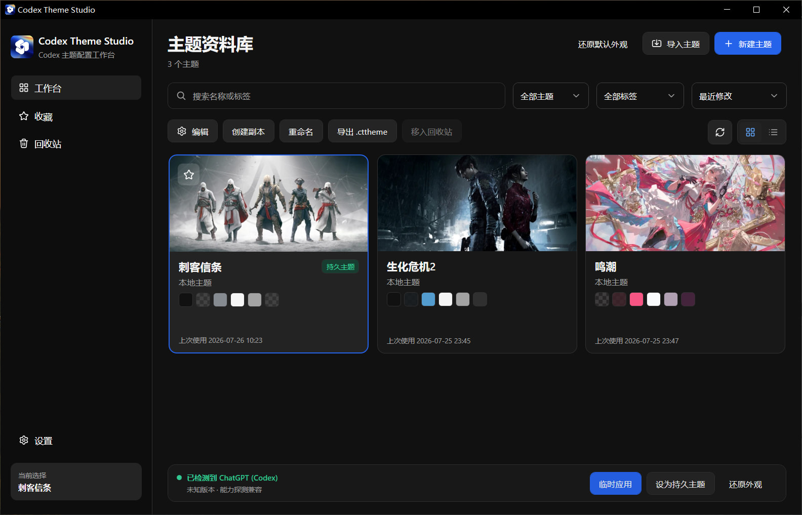
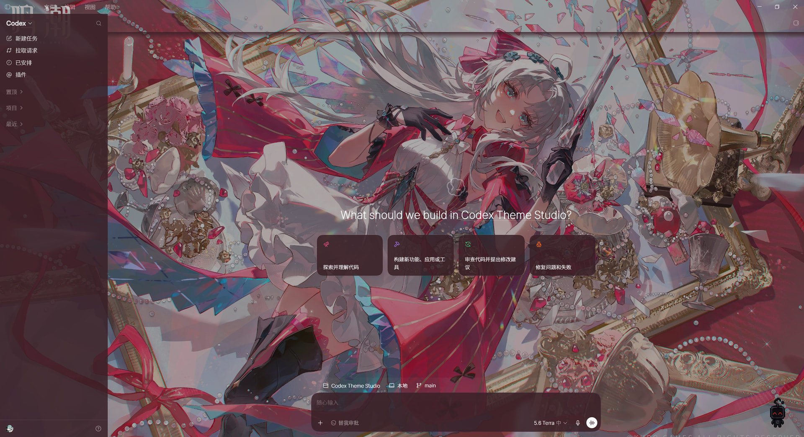
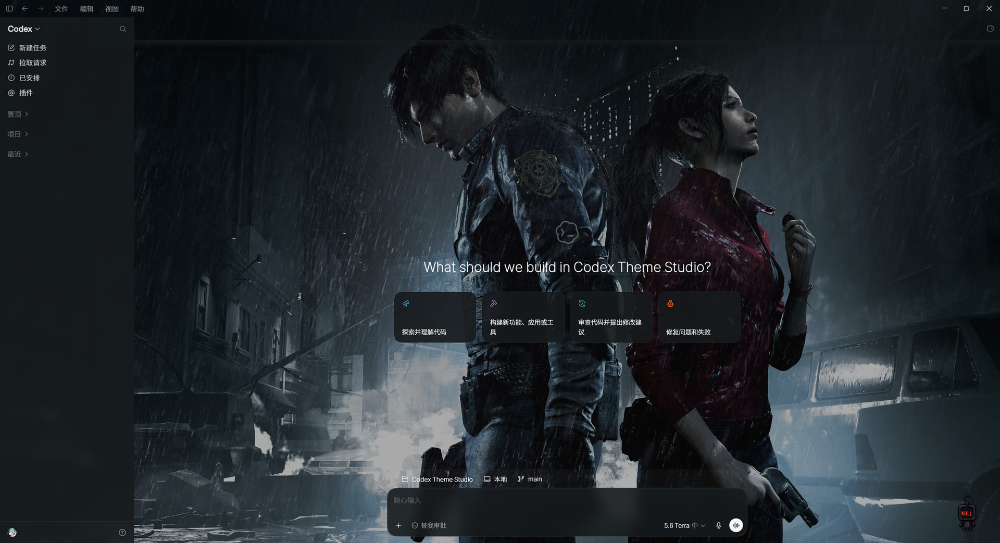
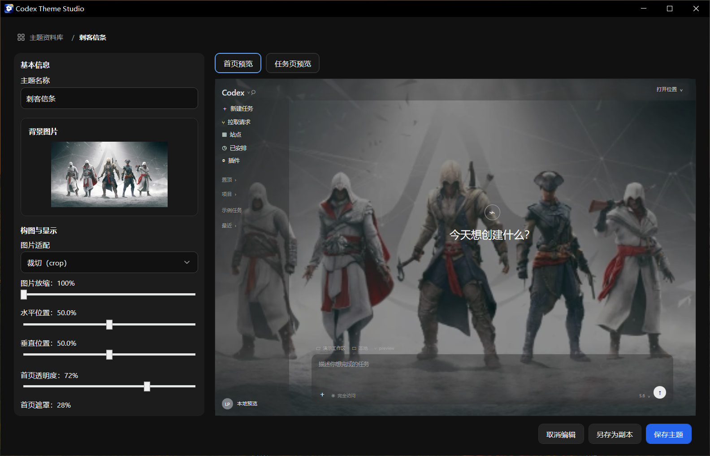

<p align="center">
  
</p>

<h1 align="center">Codex Theme Studio — Visual Theme Editor for Codex on Windows</h1>

<p align="center">
  A local-first Codex Desktop theme manager for Windows 10/11: visually create, preview, import, switch, and persist custom themes.
</p>

<p align="center">
  <a href="README.md">简体中文</a> · <a href="README.en.md">English</a> ·
  <a href="https://github.com/Aenvo/Codex-Theme-Studio/releases/latest">Download latest</a> ·
  <a href="docs/user-guide.md">User guide (Chinese)</a>
</p>

<p align="center">
  <a href="https://github.com/Aenvo/Codex-Theme-Studio/releases/latest"></a>
  
  <a href="LICENSE"></a>
</p>

> [!IMPORTANT]
> Codex Theme Studio is an independent open-source project. It is not an official OpenAI product and is not endorsed by OpenAI or by any owner of material shown in the screenshots. It does not modify Codex installation files.



## Live Results

Choose a background and palette from the theme library, adjust composition, opacity, overlay, and blur in the editor, then apply the theme temporarily to the current Codex instance or explicitly enable current-user persistence.

<table>
  <tr>
    <td width="50%" align="center">
      <br>
      <sub>Bright theme · Codex home</sub>
    </td>
    <td width="50%" align="center">
      <br>
      <sub>Dark theme · Codex home</sub>
    </td>
  </tr>
</table>



> [!NOTE]
> The screenshot backgrounds were supplied by the user and are shown only to demonstrate theme customization. Characters, works, trademarks, and image copyrights belong to their respective owners. Neither this repository nor its release packages distribute these wallpapers or imply authorization, affiliation, or endorsement. Use only local images you have the right to use.

## Why Codex Theme Studio

- **Visual editing**: Preview home and task surfaces while tuning background focus, safe area, colors, opacity, overlays, and blur.
- **Local first**: Themes, images, and indexes remain on the machine; background images, theme data, logs, and Codex pages are not uploaded.
- **Reversible by design**: Apply a temporary theme, restore the official appearance, or explicitly enable current-user persistence.
- **Portable**: The self-contained Windows x64 ZIP requires no preinstalled .NET, Node.js, npm, or npx, and does not require administrator access.

## Download and Launch

1. Open [GitHub Releases](https://github.com/Aenvo/Codex-Theme-Studio/releases/latest).
2. Download `Codex-Theme-Studio-<version>-win-x64-portable.zip` and `SHA256SUMS.txt` from the same release.
3. Verify the ZIP against `SHA256SUMS.txt`, then fully extract it to a normal writable directory such as `%USERPROFILE%\Apps\Codex Theme Studio`.
4. Double-click `CodexThemeManager.exe`.

Do not run the app from inside the ZIP, and do not use GitHub's automatically generated `Source code (zip)` or `Source code (tar.gz)` archives as the application. Regular users need the Release Asset whose name contains `win-x64-portable.zip`.

Version `1.3.1` is unsigned, so Windows may show an unknown-publisher warning. Do not run a package whose hash does not match, and do not bypass a warning by disabling security software or blindly allowlisting the app.

## Workflow

1. **Create or import**: Start a theme or import a declarative `.cttheme` package that contains no executable code.
2. **Edit and preview**: Choose a PNG, JPEG, or WebP background and tune composition plus six theme colors. Colors support `#RRGGBB` and CSS-order `#RRGGBBAA`.
3. **Apply temporarily**: Start Codex first, then select “临时应用” (Temporary Apply). For a new EXE fingerprint, the app verifies an apply → clean → reapply cycle.
4. **Persist on demand**: Persistence is available only after that cycle succeeds. It installs a low-frequency Agent and a current-user startup entry, and always requires explicit user action.
5. **Restore at any time**: “还原外观” (Restore Appearance) stops the temporary theme and, after confirmation, disables recognized persistence entries and Agents.

See the [user guide](./docs/user-guide.md) for complete usage, data locations, updates, migration, removal, and troubleshooting. The guide is currently in Chinese.

## Feature Overview

| Capability | Current behavior |
| --- | --- |
| Theme library | Create, duplicate, rename, favorite, search, sort, switch card/list views, and use the in-app recycle bin |
| Theme editing | Tune background focus, safe area, image fit, home/task opacity, overlay, blur, and six theme colors |
| Import and export | Validate declarative `.cttheme` packages; JavaScript, commands, HTML, remote CSS, and executables are rejected |
| Codex connection | Auto-detect the current user's Microsoft Store Codex or select one exact EXE and confirm its source by SHA-256 |
| Temporary and persistent themes | Temporary themes affect only the current Codex instance; persistence requires a verified cycle and explicit confirmation |
| External themes | Discover the current local OkkSkin Doro theme as read-only and duplicate it into an editable local theme |
| Data migration | Move the DataRoot to a new empty directory, verify files and SQLite integrity, and preserve the old directory as a recovery point |
| App updates | Since `1.3.0`, user-triggered stable updates use three verification layers and rollback on failure; there is no silent background installation |

## Security and Compatibility Boundaries

- Themes are applied through a short-lived loopback Inspector session, which must close after the operation. The project does not modify `WindowsApps`, `app.asar`, the Codex EXE, Appx, or digital signatures.
- It does not read or record conversation content, authentication data, API keys, models, MCP configuration, or permission settings. Once ready, the app queries the public GitHub Releases API for stable updates but does not upload themes, images, or diagnostics.
- Images are identified by content and limited to PNG, JPEG, and WebP. They are fully decoded, re-encoded into managed copies, and stripped of unnecessary metadata.
- Live verification currently covers Store Codex `26.715.4045.0`, `26.715.10079.0`, `26.721.3404.0`, `26.727.6591.0`, `26.730.8199.0`, `26.803.5235.0`, and `26.803.10989.0`. These are compatibility evidence, not an allowlist; unknown versions still require full capability probing.
- Version `1.3.1` has not completed release acceptance in a clean Windows VM without preinstalled .NET/Node or in an environment with a working Defender installation. Real updater termination and power-loss boundaries are also untested. Keep a recoverable copy before first use or update.

Do not disclose security issues in a public Issue. See the [security policy](./SECURITY.md) for reporting instructions and supported versions.

## Development and Documentation

The pinned toolchain uses .NET SDK `8.0.423` and Node.js `24.18.0`. Run these commands from the repository root:

```powershell
.\build.ps1
.\package.ps1
```

`build.ps1` performs locked restore, build, tests, formatting checks, and self-tests. After complete Release validation, `package.ps1` produces the self-contained Windows x64 portable directory, ZIP, hashes, and release manifest.

- [User guide](./docs/user-guide.md): Full usage, data locations, removal, and troubleshooting (Chinese).
- [Build guide](./docs/building.md): Development environment, verification commands, and source launch (Chinese).
- [Release process](./docs/releasing.md): Versions, tags, Draft Releases, and manual release gates (Chinese).
- [Design system](./design.md): UI tokens, component rules, and interaction guidance (Chinese).
- [Security policy](./SECURITY.md): Supported versions and vulnerability reporting.

## Community

The project has been shared with the [LINUX DO](https://linux.do/) community. Public bug reports, compatibility feedback, feature suggestions, and contributions to the Windows Codex theming experience are welcome through GitHub Issues.

## License

Unless otherwise stated, first-party source code in this repository is licensed under the [Apache License 2.0](./LICENSE). Third-party components and materials remain subject to their own licenses and attribution requirements; see [THIRD-PARTY-NOTICES.md](./THIRD-PARTY-NOTICES.md). The Apache License 2.0 does not grant rights to OpenAI, Codex, or any other third-party trademarks.
